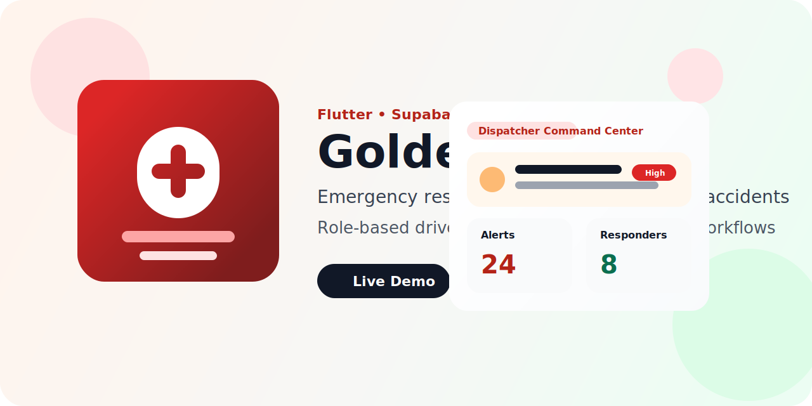

# Golden Hour



[](https://golden-hour-sandeep.web.app)
[](https://github.com/Sandeep9026/Golden-Hour)
[](https://flutter.dev/)
[](https://supabase.com/)

Golden Hour is a multi-role emergency response platform designed for highway accident scenarios. It helps drivers trigger SOS alerts, enables nearby trained first-aiders to respond faster, and gives dispatchers a central dashboard to monitor and manage active incidents during the critical golden hour.

## Live Links

- Live Demo: `https://golden-hour-sandeep.web.app`
- GitHub Repository: `https://github.com/Sandeep9026/Golden-Hour`

## Why This Project Stands Out

- Built as a complete Flutter product, not just a basic college prototype
- Supports `driver`, `first_aider`, and `dispatcher` roles
- Includes incident reporting, history, notifications, onboarding, settings, and support flows
- Uses Supabase for authentication, data storage, and backend workflows
- Deployed publicly for portfolio, placement, and resume use

## Core Features

- Manual SOS trigger with accident report creation
- Accelerometer-based crash detection heuristic
- Nearby accident alert discovery
- First-aider matching based on location and training status
- Dispatcher dashboard with incident review, note-taking, and status updates
- Incident timeline tracking with `incident_updates`
- User onboarding and safety disclaimer flow
- Notification center with read/unread state
- Emergency contacts management
- User settings for alert preferences
- Support center for feedback and issue reporting
- Public web demo deployment via Firebase Hosting

## Product Workflow

1. A user signs in and completes profile setup.
2. The app stores the role and user settings in Supabase.
3. A driver can trigger an SOS or generate an accident alert.
4. The system stores the incident in `accident_reports`.
5. Nearby alerts and responder workflows become available.
6. Dispatchers can review, acknowledge, close, and annotate incidents.
7. Incident history and notifications help track the full response lifecycle.

## Tech Stack

| Layer | Technology |
| --- | --- |
| Frontend | Flutter |
| State Management | Riverpod |
| Backend | Supabase |
| Authentication | Supabase Auth |
| Database | PostgreSQL via Supabase |
| Maps | OpenStreetMap with `flutter_map` |
| Location | `geolocator` |
| Sensors | `sensors_plus` |
| Hosting | Firebase Hosting |

## Main Modules

- Authentication and session gating
- Role-based navigation
- Driver home dashboard
- Dispatcher command center
- Incident details and timeline
- Notification center
- Emergency contacts
- Settings and onboarding
- Support center
- Supabase-backed backend services

## Project Structure

```text
golden_hour/
├── lib/
│   ├── main.dart
│   ├── screens/
│   ├── services/
│   └── ...
├── assets/
│   ├── models/
│   └── readme/
├── web/
├── android/
├── ios/
├── supabase_schema.sql
├── firebase.json
└── README.md
```

## Demo Accounts and Roles

You can create separate accounts and assign different roles from the `profiles` table in Supabase:

- `driver`
- `first_aider`
- `dispatcher`

This makes it easy to demonstrate the full multi-role workflow during placements or project presentations.

## Local Setup

### 1. Install dependencies

```powershell
cd d:\accident\golden_hour
flutter pub get
```

### 2. Configure Supabase

1. Create a Supabase project
2. Run [supabase_schema.sql](supabase_schema.sql) in the Supabase SQL Editor
3. Copy the `Project URL`
4. Copy the `anon public` key

### 3. Run locally

```powershell
flutter run --dart-define=SUPABASE_URL=https://YOUR-PROJECT.supabase.co --dart-define=SUPABASE_ANON_KEY=YOUR-ANON-KEY
```

### 4. Build web release

```powershell
flutter build web --release --dart-define=SUPABASE_URL=https://YOUR-PROJECT.supabase.co --dart-define=SUPABASE_ANON_KEY=YOUR-ANON-KEY
```

## Deployment

This project is deployed on Firebase Hosting.

```powershell
firebase deploy
```

Live URL:

`https://golden-hour-sandeep.web.app`

## Screens and Experience

- Login and authentication flow
- Profile setup flow
- Driver home dashboard
- Dispatcher command center
- Incident details view
- History and notification center
- Settings, onboarding, support, and emergency contacts

## Resume Description

Golden Hour is a Flutter and Supabase based emergency response platform for highway accidents. It includes multi-role workflows for drivers, trained first-aiders, and dispatchers, along with SOS reporting, incident lifecycle management, alert history, user settings, and public web deployment.

## Resume Bullet Points

- Built and deployed `Golden Hour`, a Flutter-based emergency response platform for highway accidents with live web hosting and Supabase backend integration.
- Designed multi-role workflows for `drivers`, `first_aiders`, and `dispatchers`, including role-based routing, incident handling, and response coordination.
- Implemented accident reporting, incident history, notification center, onboarding, support flow, and emergency contact management.
- Integrated Supabase Auth and PostgreSQL schema design with row-level security policies and reusable backend service layers.

## Important Notes

- This is a strong portfolio-ready and placement-ready project
- It is publicly deployable as a web product demo
- Some advanced production capabilities such as official emergency integration and full push-delivery infrastructure remain future enhancements
- The current version is excellent for resume, GitHub, project showcase, and interview discussion

## Project Documents

- [PROJECT_EXPLANATION.md](PROJECT_EXPLANATION.md)
- [NEXT_PHASE_CHECKLIST.md](NEXT_PHASE_CHECKLIST.md)
- [FINAL_STATUS.md](FINAL_STATUS.md)
- [RELEASE_CHECKLIST.md](RELEASE_CHECKLIST.md)
- [ANDROID_RELEASE_GUIDE.md](ANDROID_RELEASE_GUIDE.md)
- [PUBLIC_RELEASE_ROADMAP.md](PUBLIC_RELEASE_ROADMAP.md)
- [PRIVACY_POLICY.md](PRIVACY_POLICY.md)
- [TERMS_OF_USE.md](TERMS_OF_USE.md)

## Author

Sandeep Yadav

- GitHub: [Sandeep9026](https://github.com/Sandeep9026)
- Project: [Golden Hour Repository](https://github.com/Sandeep9026/Golden-Hour)
- Live Demo: [golden-hour-sandeep.web.app](https://golden-hour-sandeep.web.app)
